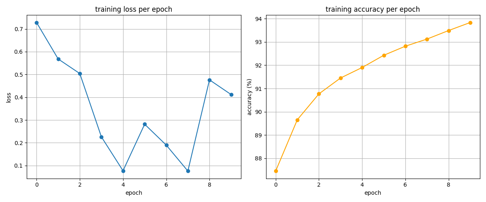
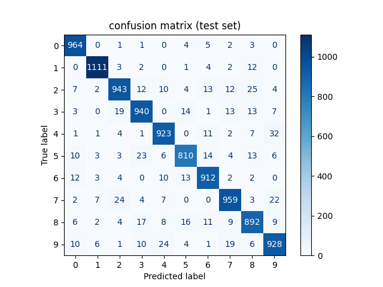
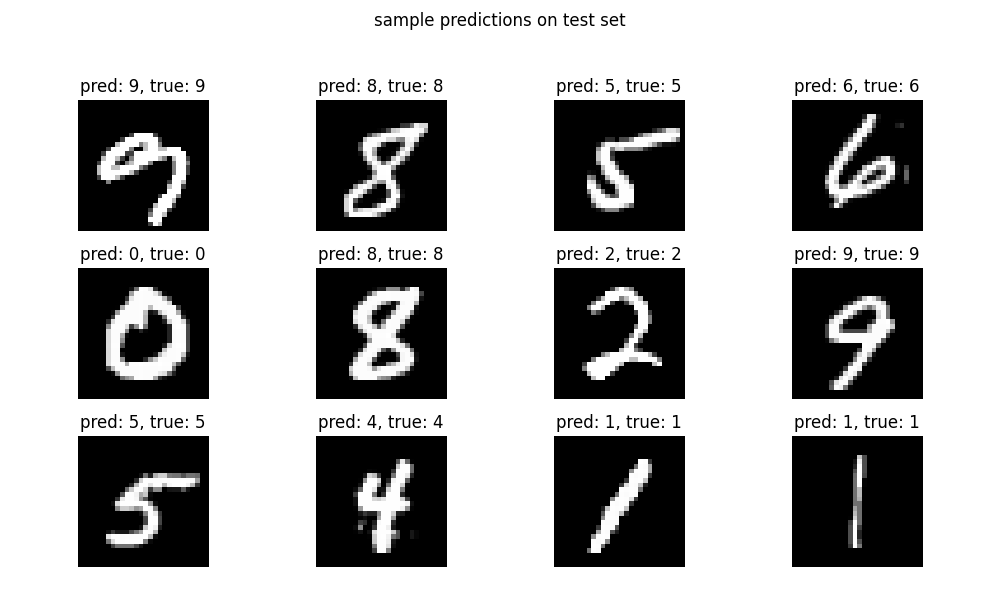

# Simple Neural Network from Scratch (NumPy Only)

This project demonstrates how to build, train, and evaluate a simple neural network for handwritten digit recognition (MNIST) using only NumPy and basic Python libraries—no TensorFlow or PyTorch required!

---

## Table of Contents
- [Introduction](#introduction)
- [How Neural Networks Work](#how-neural-networks-work)
- [The Math Behind Neural Networks](#the-math-behind-neural-networks)
- [Building a Neural Network from Scratch](#building-a-neural-network-from-scratch)
- [Project Structure](#project-structure)
- [Setup & Installation](#setup--installation)
- [Usage](#usage)
- [Results & Visualization](#results--visualization)
- [Saving & Loading the Model](#saving--loading-the-model)
- [References](#references)

---

## Introduction
A neural network is a computational model inspired by the human brain. It consists of layers of interconnected "neurons" that can learn to recognize patterns in data. This project shows how to implement a basic feedforward neural network for classifying handwritten digits from the MNIST dataset, using only NumPy and math—no deep learning frameworks!

---

## How Neural Networks Work
A neural network is made up of layers:
- **Input Layer:** Receives the raw data (e.g., pixel values of an image).
- **Hidden Layer(s):** Intermediate layers that learn complex features.
- **Output Layer:** Produces the final prediction (e.g., digit class 0-9).

Each neuron computes a weighted sum of its inputs, adds a bias, and applies an activation function (like ReLU or softmax). The network learns by adjusting weights and biases to minimize a loss function (e.g., cross-entropy) using a process called backpropagation.

### Key Concepts
- **Forward Pass:** Data flows through the network to produce predictions.
- **Loss Function:** Measures how far predictions are from true labels.
- **Backward Pass (Backpropagation):** Computes gradients of the loss with respect to weights, allowing the network to learn.
- **Gradient Descent:** Updates weights to minimize the loss.

---

## The Math Behind Neural Networks
A neural network is just a bunch of matrix multiplications, non-linearities, and a sprinkle of calculus. Here’s a quick breakdown:

### 1. Forward Pass (aka: "What does the network think?")
- **Hidden Layer:**
  - Compute:
    ```math
    Z_1 = X W_1 + b_1
    ```
  - Activation:
    ```math
    A_1 = \text{ReLU}(Z_1)
    ```
- **Output Layer:**
  - Compute:
    ```math
    Z_2 = A_1 W_2 + b_2
    ```
  - Activation:
    ```math
    A_2 = \text{softmax}(Z_2)
    ```

### 2. Loss (aka: "How much did we mess up?")
- **Cross-Entropy Loss:**
  ```math
  L = -\frac{1}{N} \sum_{i=1}^N \sum_{k=1}^C y_{i,k} \log(\hat{y}_{i,k})
  ```
  Where:
  - $N$ is the number of samples
  - $C$ is the number of classes
  - $y_{i,k}$ is 1 if sample $i$ belongs to class $k$, else 0
  - $\hat{y}_{i,k}$ is the predicted probability that sample $i$ is class $k$

### 3. Backpropagation (aka: "How do we fix our mistakes?")
- Compute gradients of the loss with respect to all weights and biases using the chain rule:
  ```math
  \frac{\partial L}{\partial W_2}, \quad \frac{\partial L}{\partial b_2}, \quad \frac{\partial L}{\partial W_1}, \quad \frac{\partial L}{\partial b_1}
  ```
- These gradients tell us how to nudge each parameter to make the loss smaller next time.

### 4. Gradient Descent (aka: "Level up!")
- Update each parameter:
  ```math
  W \leftarrow W - \text{learning rate} \times \text{gradient}
  ```

That’s it! Stack these steps for a bunch of epochs and your network learns to recognize digits like a pro.

---

## Building a Neural Network from Scratch
This project implements:
- **Activation Functions:** ReLU and softmax
- **Loss Function:** Cross-entropy
- **Manual Backpropagation:** Using NumPy for all math
- **Batch Training:** Updates weights in small batches for efficiency
- **Visualization:** Plots training loss, accuracy, and confusion matrix

**No deep learning libraries are used!**

---

## Project Structure
- `nn.py` — Main script containing all code: data loading, model, training, evaluation, and visualization.
- `requirements.txt` — List of required Python packages.
- `simple_nn_weights.npz` — Saved model weights (created after training).

---

## Setup & Installation
1. **Clone the repository:**
   ```bash
   git clone https://github.com/fearyan/Neural-Network-from-Scratch.git
   cd NN
   ```
2. **Install dependencies:**
   ```bash
   pip install -r requirements.txt
   ```

---

## Usage
Simply run the main script:
```bash
python nn.py
```
This will:
- Download and preprocess the MNIST dataset
- Train a neural network on the training set
- Plot training loss and accuracy
- Evaluate on the test set and show a confusion matrix
- Display sample predictions
- Save the trained model weights

---

## Results & Visualization
- **Training Loss & Accuracy:** Plots show how the model improves over epochs.
- **Confusion Matrix:** Visualizes where the model makes mistakes on the test set.
- **Sample Predictions:** See how the model performs on random test images.

---

### Output Figures



*Figure 1: Training loss and accuracy per epoch. Watch your model glow up as it learns!*



*Figure 2: Confusion matrix on the test set. Shows which digits the model confuses most.*



*Figure 3: Random sample predictions from the test set. Flexing the model’s digit recognition skills.*

---

## Saving & Loading the Model
After training, model weights are saved to `simple_nn_weights.npz`. You can load these weights later for inference or further training.

---

## References
- [Neural Networks and Deep Learning — Michael Nielsen](http://neuralnetworksanddeeplearning.com/)
- [CS231n: Convolutional Neural Networks for Visual Recognition](http://cs231n.stanford.edu/)
- [MNIST Dataset](http://yann.lecun.com/exdb/mnist/)
- [NumPy Documentation](https://numpy.org/doc/)

---

## Further Reading
- [Backpropagation Explained](https://en.wikipedia.org/wiki/Backpropagation)
- [Activation Functions](https://en.wikipedia.org/wiki/Activation_function)

---

## License
MIT License 
